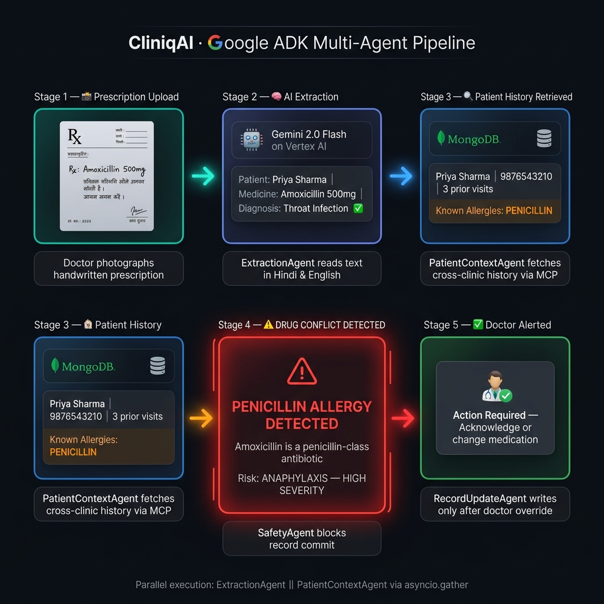
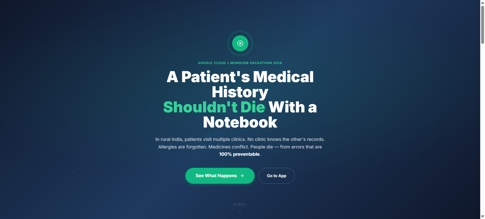
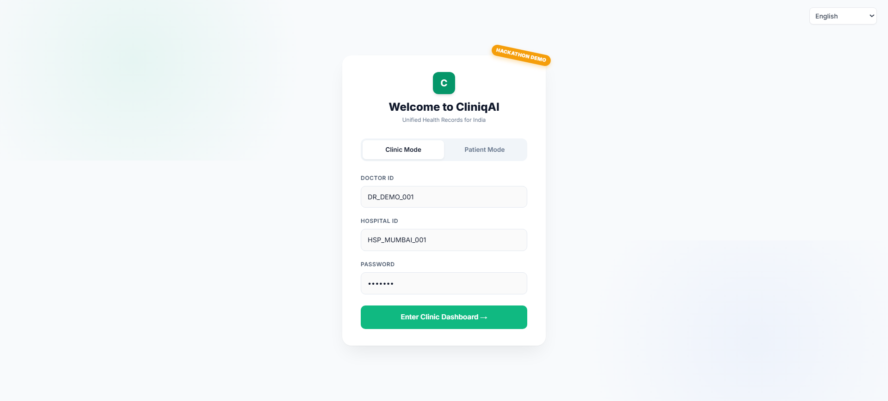
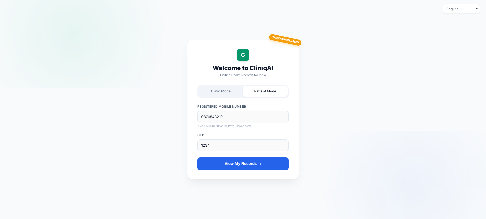
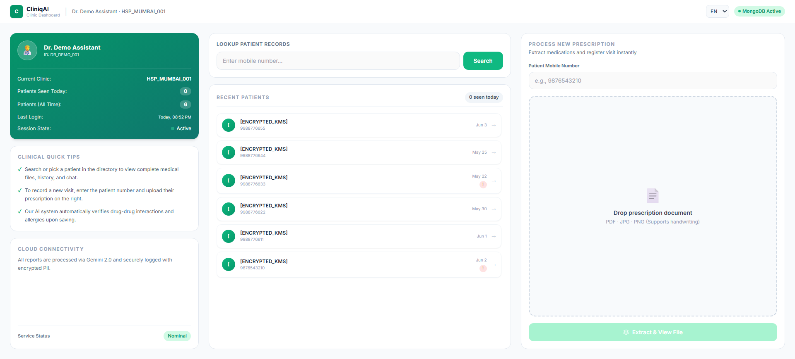
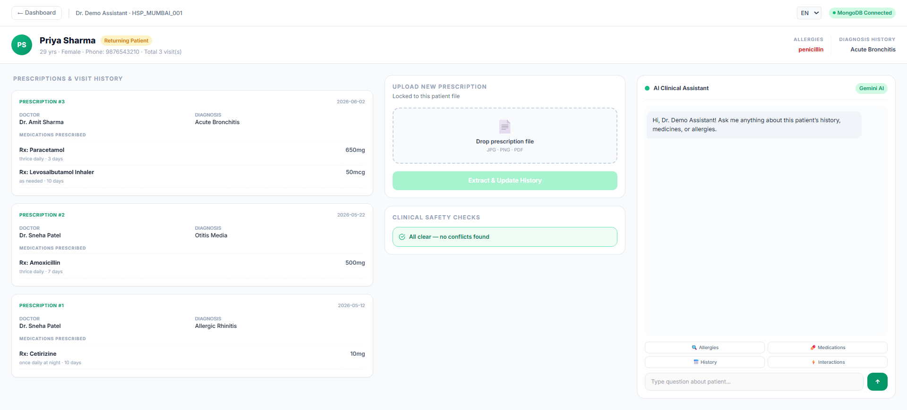
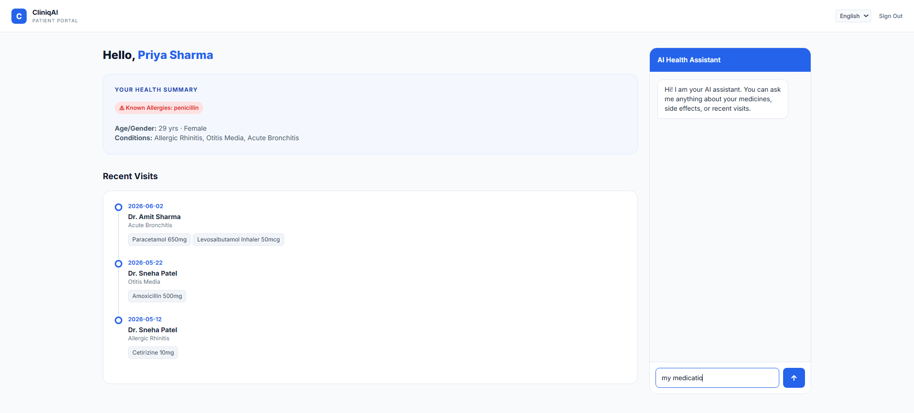

<div align="center">

# 🏥 CliniqAI
### *Multi-Agent Clinical Workflow — Built on Google ADK*

[](https://cliniqai-1072937704425.asia-south1.run.app)
[](https://google.github.io/adk-docs/)
[](https://cloud.google.com/vertex-ai)
[](https://www.mongodb.com/atlas)
[](https://cloud.run)

**👉 [TRY IT LIVE RIGHT NOW](https://cliniqai-1072937704425.asia-south1.run.app) 👈**

> *Demo credentials pre-filled. Just click Login.*

</div>

---

## ⚡ How It Works — In One Image

> **The entire multi-agent pipeline, in a single glance.** From a handwritten Hindi prescription to a blocking drug-allergy alert — all automated, all traceable.



---

## 🎬 Demo Video

> **[▶ Watch the 3-Minute Demo](https://cliniqai-1072937704425.asia-south1.run.app)** — See CliniqAI's multi-agent pipeline prevent a drug interaction in real time, across clinics, in Hindi.

[](https://cliniqai-1072937704425.asia-south1.run.app)

---

## 🚨 The Problem — A Life-or-Death Gap in Healthcare

**India has 1.3 million small clinics. 95% of them use paper registers.**

This is not an inconvenience. It kills people.

| Reality | Scale |
|:--------|:------|
| 💊 Preventable drug interactions | 5.6 million hospitalizations/year |
| 📋 Patients visiting 2+ clinics with no shared records | Every rural patient, every day |
| 🗒️ Paper registers with no allergy history | 95% of India's 1,300,000 clinics |
| 💸 Existing EHR systems (Epic, Cerner) cost | $370,000+ per year to implement |

**The gap:** Big hospitals get expensive EHR systems. Small clinics get nothing.  
**CliniqAI fills that gap — completely free, deployed in 5 minutes.**

---

## 🤖 The Core Architecture — Real Multi-Agent Orchestration with Google ADK

This is not a single LLM call wrapped in an API. CliniqAI implements a **true multi-agent system** using Google's Agent Development Kit (ADK): a Supervisor that coordinates four specialized, independent agents — each with a single responsibility, each traceable, each replaceable.

### The Supervisor Pattern

```
📸 Doctor uploads handwritten prescription (Hindi / English)
          │
          ▼
┌─────────────────────────────────────────────────────────┐
│               SUPERVISOR (ADK Orchestrator)             │
│                                                         │
│  ┌─────────────────────┐  ┌──────────────────────────┐  │
│  │   ExtractionAgent   │  │  PatientContextAgent     │  │
│  │                     │  │                          │  │
│  │  Gemini 2.0 Flash   │  │  MongoDB Atlas via MCP   │  │
│  │  reads prescription │  │  fetches patient history │  │
│  │  → structured JSON  │  │  → allergies, active Rx  │  │
│  └─────────┬───────────┘  └──────────┬───────────────┘  │
│            │   asyncio.gather()      │                   │
│            └────────────┬────────────┘                   │
│                         ▼                                │
│              ┌──────────────────┐                        │
│              │   SafetyAgent    │                        │
│              │                 │                        │
│              │ checks medicines│                        │
│              │ against history │                        │
│              │ → ALERT or PASS │                        │
│              └────────┬─────────┘                       │
│                       │                                  │
│              ┌────────▼──────────┐                      │
│              │  RecordUpdateAgent│                      │
│              │                  │                      │
│              │  writes visit to │                      │
│              │  MongoDB + audit │                      │
│              │  trail           │                      │
│              └──────────────────┘                      │
└─────────────────────────────────────────────────────────┘
          │
          ▼
⚠️  "Patient has Penicillin allergy — prescribed Amoxicillin!"
          │
          ▼
✅  Doctor changes medication. Patient is safe.
```

### Why This Architecture Matters

| Design Decision | What It Enables |
|:----------------|:----------------|
| **Parallel execution** (`asyncio.gather`) | ExtractionAgent and PatientContextAgent run simultaneously — Gemini's OCR latency is hidden behind the MongoDB lookup |
| **Pydantic-validated state handoff** | Each agent's output is schema-validated before the next agent receives it — no silent data corruption across agent boundaries |
| **Confidence-gated workflow** | If extraction confidence < 0.5 on critical fields (medicines, patient name), the Supervisor flags `REVIEW_REQUIRED` before writing to the database |
| **Safety gate before persistence** | HIGH-severity drug alerts block record commit until doctor override is logged — the safety check is a hard gate, not a suggestion |
| **Full trace log per workflow** | Every agent invocation — agent name, start time, duration\_ms, status — is recorded in `WorkflowState.trace` for auditability |
| **ADK-native tool mapping** | Vision tool and alert tool are registered as `FunctionTool`; MongoDB is connected as `McpToolset` — the same tools the ADK Agent uses |

---

## 🏗️ Full Stack

```
┌─────────────────────────────────────────────────────────────┐
│                        CLINIQAI SYSTEM                      │
│                                                             │
│  📱 Web Client (Clinic + Patient Portal)                    │
│       │                                                     │
│       ▼                                                     │
│  ☁️  Cloud Run (FastAPI Backend)                            │
│       │                                                     │
│       ├──► 🤖 ADK Supervisor (Orchestrator)                 │
│       │         │                                           │
│       │         ├──► 🧠 ExtractionAgent                    │
│       │         │    └─ Gemini 2.0 Flash on Vertex AI      │
│       │         │       (Handwriting OCR, Hindi/English)   │
│       │         │                                           │
│       │         ├──► 🔍 PatientContextAgent                │
│       │         │    └─ MongoDB Atlas via MCP Server        │
│       │         │       (Cross-clinic history + allergies) │
│       │         │                                           │
│       │         ├──► ⚠️  SafetyAgent                       │
│       │         │    └─ Drug conflict + allergy evaluation  │
│       │         │                                           │
│       │         └──► 💾 RecordUpdateAgent                  │
│       │              └─ Persistent write + audit trail      │
│       │                                                     │
│       └──► 🗄️  Cloud Storage                               │
│                (Original prescription image archive)        │
└─────────────────────────────────────────────────────────────┘
```

| Layer | Technology |
|:------|:-----------|
| **Agent Orchestration** | **Google Agent Development Kit (ADK)** — `Supervisor` + 4 specialized agents |
| **Parallel Execution** | `asyncio.gather` — ExtractionAgent ∥ PatientContextAgent |
| **AI / Multilingual OCR** | **Gemini 2.0 Flash on Vertex AI** |
| **Patient Memory** | **MongoDB Atlas** connected via **MCP Server** (`McpToolset`) |
| **Document Storage** | **Google Cloud Storage** |
| **Deployment** | **Google Cloud Run** |
| **Backend** | **Python + FastAPI** |

---

## ✨ Key Capabilities

### 1. 🖊️ Multilingual Handwriting Extraction *(ExtractionAgent → Gemini 2.0 Flash on Vertex AI)*
Upload a photo of a handwritten prescription in **English, Hindi, Bengali, Telugu, Marathi, or Tamil**. The ExtractionAgent calls Gemini with structured output schema to return diagnosis, medications, dosages, and doctor notes as validated JSON — no manual typing, no regex parsing.

### 2. 🤖 Supervised Multi-Agent Orchestration *(Google ADK Supervisor)*
The Supervisor wires four independent agents into a deterministic pipeline with hard validation gates between each step. ExtractionAgent and PatientContextAgent execute in **parallel** via `asyncio.gather` to minimize end-to-end latency. The Supervisor maintains a full `WorkflowState` trace across all agents — not a single monolithic function.

### 3. ⚠️ Real-Time Drug Safety with a Hard Gate *(SafetyAgent)*
Before any record is committed, the SafetyAgent cross-checks every extracted medication against:
- Known patient allergies (across all clinics in history)
- Active concurrent medications (duplicate / conflicting prescriptions)
- Drug-to-drug interaction flags

A HIGH-severity alert sets `requires_override = True` on the `SafetyAssessment`, which the Supervisor enforces as a blocking gate — the RecordUpdateAgent will not write until the doctor explicitly acknowledges.

### 4. 🔍 Cross-Clinic Patient Memory *(PatientContextAgent → MongoDB Atlas MCP)*
MongoDB Atlas is connected to the ADK agent as an `McpToolset`. A patient's complete history — every clinic they've ever visited — is retrieved by mobile number. One phone number = one permanent medical record, regardless of which clinic the patient is at today.

### 5. 🔐 Patient-Controlled Access
Patients grant and revoke clinic access in real time. Complete data sovereignty — patients own their records, not individual clinics.

---

## 🎯 Impact Metrics

| Metric | Value |
|:-------|:------|
| Target Market | 1.3M small clinics in India |
| Addressable Patients | 800M+ in India's rural/semi-urban areas |
| Cost to Implement | **₹0 (Free)** |
| Setup Time | **5 minutes** |
| Languages Supported | 6 (English, Hindi, Bengali, Telugu, Marathi, Tamil) |
| Prescription Processing | **< 3 seconds** end-to-end |

---

## 📱 Application Walkthrough

### Landing Page — *The Problem Made Visceral*
Real statistics, a timeline of a composite patient case (Priya), and a clear "How It Works" — judges understand the why in 30 seconds.


---

### Dual Login — *Clinic Mode & Patient Mode*
Pre-filled demo credentials for instant hackathon testing. No setup friction.

| Clinic Login | Patient Login |
|:---:|:---:|
|  |  |

> **Demo Credentials:**
> - **Clinic:** `DR_DEMO_001` / `HSP_MUMBAI_001` / `demo123`  
> - **Patient:** Mobile `9876543210` → OTP `1234`

---

### Clinic Dashboard — *Doctor's Command Center*
Search patients by phone number, view the active queue, and open any patient file instantly.



---

### Patient Clinical File — *Complete Medical Intelligence*
Every visit, every prescription, every test, every allergy — in one screen. With the **AI Clinical Assistant** chat backed by the ADK agent's MongoDB MCP tool.



---

### Patient Portal — *Patients Own Their Data*
Patients view all records from all clinics, manage access permissions, and query the AI health assistant about their own medications.



---

## ⚡ Quick Start — Run in 3 Steps

```bash
# 1. Clone the repository
git clone https://github.com/your-username/Google-Cloud-Rapid-Agent-Hackathon.git
cd Google-Cloud-Rapid-Agent-Hackathon

# 2. Set up environment
cp .env.example .env
# Fill in: GOOGLE_CLOUD_PROJECT, MONGODB_URI, VERTEX_AI_LOCATION

# 3. Run locally
pip install -r requirements.txt
python -m uvicorn cliniqai.main:app --reload
```

**Or use the live deployment → [https://cliniqai-1072937704425.asia-south1.run.app](https://cliniqai-1072937704425.asia-south1.run.app)**

---

## 🔧 Environment Variables

```env
GOOGLE_CLOUD_PROJECT=your-gcp-project-id
VERTEX_AI_LOCATION=asia-south1
GCS_BUCKET_NAME=your-prescriptions-bucket
MONGODB_URI=your-mongodb-atlas-connection-string
MONGODB_DB_NAME=cliniqai
```

---

## 🔬 Agent Implementation Reference

The orchestration code is in [`cliniqai/agent/orchestration/`](cliniqai/agent/orchestration/):

| File | Role |
|:-----|:-----|
| [`supervisor.py`](cliniqai/agent/orchestration/supervisor.py) | Orchestrator — parallel gather, validation gates, trace log |
| [`agents/extraction_agent.py`](cliniqai/agent/orchestration/agents/extraction_agent.py) | Calls Gemini 2.0 Flash for OCR, returns `ExtractedData` |
| [`agents/patient_context_agent.py`](cliniqai/agent/orchestration/agents/patient_context_agent.py) | Fetches & merges patient history via MongoDB MCP |
| [`agents/safety_agent.py`](cliniqai/agent/orchestration/agents/safety_agent.py) | Evaluates drug conflicts, sets `requires_override` flag |
| [`agents/record_update_agent.py`](cliniqai/agent/orchestration/agents/record_update_agent.py) | Persists visit record with full audit trail |
| [`adk_wrapper.py`](cliniqai/agent/orchestration/adk_wrapper.py) | ADK `Agent` definition with `FunctionTool` + `McpToolset` mapping |
| [`state.py`](cliniqai/agent/orchestration/state.py) | Pydantic `WorkflowState` — shared schema across all agents |

---

## 🚧 Challenges We Solved

| Challenge | How We Solved It |
|:----------|:----------------|
| Gemini OCR latency on slow connections | ExtractionAgent and PatientContextAgent run in **parallel** (`asyncio.gather`) — MongoDB lookup hides the Gemini call latency |
| Silent data corruption between agents | Pydantic schema validation at every agent boundary via `WorkflowState` — the Supervisor rejects malformed output before the next agent starts |
| Blocking safety alerts without UX friction | `SafetyAssessment.requires_override` flag propagates through the Supervisor as a hard gate; the UI renders a mandatory acknowledgement modal |
| Cross-clinic records without shared logins | Patient identified by mobile number as the universal key across all clinics in MongoDB |
| Handwritten Hindi OCR accuracy | Few-shot structured-output prompting with Gemini — confidence scores returned per-field; low-confidence triggers `REVIEW_REQUIRED` in the Supervisor |
| MCP tool reliability in production | `McpToolset` with connection pooling; async MongoDB Atlas MCP server |

---

## 🔮 What's Next — The Roadmap

- [ ] **WhatsApp Integration** — Doctors upload prescription photos via WhatsApp bot
- [ ] **Voice-First Interface** — Hindi voice commands for rural doctors with low digital literacy  
- [ ] **Government Health Scheme Linking** — ABHA (Ayushman Bharat Health Account) integration
- [ ] **Predictive Analytics** — Population-level disease trend detection from anonymized data
- [ ] **Pharmacy Connect** — Auto-send verified prescriptions to the nearest pharmacy

---

## 👥 Team

Built with ❤️ for the **Google Cloud Rapid Agent Hackathon**

> *"We didn't build a single-LLM chatbot. We built a real multi-agent clinical system — Supervisor, four specialized agents, MCP-connected memory, hard safety gates — that 95% of clinics in the world can actually use: free, mobile, multilingual, and safe."*

---

## 📄 Additional Documentation

| Document | Description |
|:---------|:------------|
| [Complete Build Plan](CliniqAI_Complete_Build_Plan.md) | Full technical implementation guide |
| [Deployment Guide](DEPLOYMENT_GUIDE.md) | Step-by-step Google Cloud deployment |
| [Why CliniqAI is Different](WHY_CLINIQAI_IS_DIFFERENT.md) | Market positioning & competitive analysis |
| [Phase 2: HIE Implementation](PHASE_2_HIE_IMPLEMENTATION.md) | Health Information Exchange roadmap |

---

<div align="center">

**Built on Google Cloud · Orchestrated with Google ADK · Deployed on Cloud Run**

[](https://google.github.io/adk-docs/)
[](https://cloud.google.com/vertex-ai)
[](https://mongodb.com)

*For 800 million patients who deserve better healthcare.*

</div>
